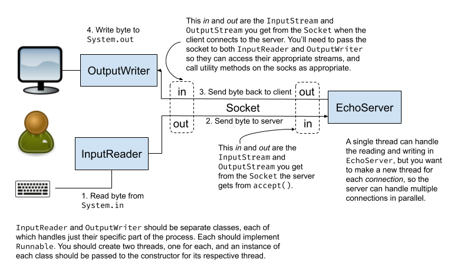

[](https://classroom.github.com/open-in-codespaces?assignment_repo_id=9162458)
# Threaded Echo Client-Server <!-- omit in toc -->

[](../../actions?query=workflow%3A"Bats+tests")

- [Overview](#overview)
- [Testing this lab](#testing-this-lab)
- [The overall architecture](#the-overall-architecture)
- [Add threads to your echo client](#add-threads-to-your-echo-client)
- [Make your echo server multi-threaded](#make-your-echo-server-multi-threaded)
- [A stress-testing script](#a-stress-testing-script)

## Overview

Threading is a powerful, but often tricky, tool that allows us to
write _concurrent_ programs, where two or more things are happening
at once.

This can have several advantages:

- Performance: If there are multiple things happening at the same
  time on a multi-processor computer, that can reduce the overall
  time for a computation. This is often referred to as _parallelism_.
- Reduced blocking: There are times when a program is waiting for
  something that could take a while, or possibly an unknown period
  of time. In the Echo Server program, for example, the server has
  no _a priori_ knowledge of how much data the client will send, so
  it is forced to wait indefinitely on the client. This _blocks_ the
  server, and means it can only handle one client at a time. With
  threads we can create a separate thread for every connection, allowing
  the server to respond "in parallel" to many clients at the same time.
- Better logical separation: There are times where a program naturally
  separates into multiple internal processes that make sense to run
  "independently" at the same time ("in parallel"). Threads allows us
  to do this, potentially creating clearer organization for our system.

There are, however, a number of challenges that come with this, most of which
come from the difficulties in synchronizing and communicating between
threads. Problems can include:

- How do you communicate information in a reliable way between threads? It
  turns out that there's a lot of ways in which that can go wrong, often
  resulting in what are called _race conditions_. In a race condition, you
  get different results from the program depending on the _timing_ of events
  in the various threads. These can be particularly difficult because the
  behavior can vary from one run of the program to another, making debugging
  super difficult.
- Race conditions are often addressed using _synchronization_, but getting
  synchronization correct can be quite tricky, with using too little
  synchronization leading to race conditions, and using too much leading to
  either substantial reductions in performance advantages from parallelism
  or problems called _deadlock_ (where two or more threads block forever,
  each waiting for another), or both.

We won't become experts in the complexities of concurrent programming in
just a few labs, but these will hopefully highlight some of the potential
and challenges.

In this lab you'll:

- Re-write your echo client from the previous lab to use threads to
  separate the two communication directions.
- Make your echo server multi-threaded.

At the top of this lab is a status badge that should display the status of your
project. It'll start out showing the project as failing (because the starter code
doesn't pass the tests), but when you've got everything working it should change
to a green passing state.

We've created [a very simple example of creating and using threads](https://gist.github.com/NicMcPhee/0f6bdf1e8cfcd4449c819136f7567c0d), and
there's lots of info on-line about threading in Java. I think both of these
short tutorials are useful background for this and some of the subsequent labs:

- [W3Schools threads tutorial](https://www.w3schools.com/java/java_threads.asp)
- [Geeks for Geeks threads tutorial](https://www.geeksforgeeks.org/java-multithreading-tutorial/)

## Testing this lab

The testing for this lab is essentially the same as for
[the non-threaded version](https://github.com/UMM-CSci-Systems/Echo-client-server).
In fact the tests (and the user) can't easily tell whether the client or server
is implemented with threads or not since the behavior should generally be identical
to the non-threaded version.

The "throw a bunch of clients at the server" idea at the end of the write-up is
the closest thing to a way of testing for "threaded-ness", but that's a manual
test instead of an automated test, so it's not as nice or useful.

There are tools specifically designed to stress test servers
by sending large amounts of traffic their way, but that's
a layer of complexity we've chosen to avoid so far.

## The overall architecture

This diagram shows the basic communication structure we're proposing
in more detail below:



:bangbang: **NOTE** This diagram probably is unreadable with a black
background, so it won't make much or any sense if you're on GitHub in
dark mode. I think that [this link](https://raw.githubusercontent.com/UMM-CSci-Systems/Threaded-echo-client-server/main/Threaded-Echo-Client-Server.png)
will display the image one its own and hopefully it will be more readable that
way.

There are two key ideas here:

**The client will have _two_ threads.**

- One is _solely_ responsible for
  reading single bytes from standard input (the keyboard) and writing
  those bytes to the socket. That's all it does.
- The other is _solely_ responsible for reading a byte from the
  socket and writing it to standard output. That's all it does.
- This nicely decouples the reading and writing activities, and allows
  other code to continue to run even if one or both of these threads
  is blocking while waiting for data to come to it.

**The server will have one thread _for each connection_.**

- Every time a connection is made, the server will create a thread
  specifically to handle that client.
- Each thread will be responsible for both reading from the socket
  and writing to the socket.
- By creating a thread for each client, the server can handle
  multiple clients at the same time in parallel, without activity
  (or inactivity) on any client blocking progress for the other
  clients.

You can (and should) thread the client and server separately, so the
write-up below treats them as independent pieces of the lab.

## Add threads to your echo client

In a previous lab you wrote an echo server and an echo client without threads.
Without threads it's possible for your client code to lock up whatever larger
Java program it happens to be part of. An alternative that simplifies the
thinking quite a bit is to add two threads to your client:

- One reads bytes from standard input (the keyboard) and writes the to the server socket
- One reads bytes from the server socket and writes them to standard output (the screen)

This way the reading can never block the writing and vice versa.

While adding threads ultimately does make the logic simpler, there is still
the potential for strange interactions here, so be careful and ask questions
if it's making you crazy.

The part I found a bit tricky was how to shut
everything down gracefully. The problem there is that when I terminate my
keyboard input (through CTRL-D, for example) several things need to happen
(and in a particular order):

- I need the client to tell the server that it's done sending information.
  - This is necessary so that the server can finish sending any remaining data.
  - It's also necessary for the server to shut down the socket after it's done, and it won't know to do that unless it hears from the client that we're done.
- ***BUT*** I need to do this without closing down the socket, since there might be data coming back from the server that hasn't been sent yet.
  - This means I can't close the socket, or even close the `OutputStream` that connects the client to the server. (If I close the stream, it closes the socket. This isn't necessarily obvious, but [it's documented in the Java API](http://java.sun.com/javase/6/docs/api/java/net/Socket.html#getOutputStream()).)
- I found the `Socket.shutdownOutput` method *very* useful in this regard :-).
- I also found it necessary to call `flush()` on my standard output to make sure the last bytes were written out before that standard output thread finished up.
- One way to test that you're handling binary data correctly is to send and receive a JPEG. You could, for example, use the picture of pumpkins (`test/etc/pumpkins.jpg`), send it, and compare what you get back with the original:
  - `java echoserver.EchoClientMain < ../test/etc/pumpkins.jpg > Copy_of_pumpkins.jpg`
  - `diff ../test/etc/pumpkins.jpg Copy_of_pumpkins.jpg`
- One of the nice things about this as a test is that incomplete JPEGs will actually display. Thus before I had the necessary `flush()` on my standard output, I was getting a file that was a little short (and so the `diff` said they were different), but was visibly "heading in the right direction". (It was obviously the pumpkins image, but with a little noise in the bottom right corner where the last bit of data was missing.) This made it clear that my echo system was correctly transmitting the binary data (I wasn't converting binary to character, and throwing away some bits in the process), I just wasn't transmitting *enough* of it. If opening `Copy_of_pumpkins.jpg` had displayed gobbledygook, or I'd gotten an error saying it wasn't a properly formatted image file, then I'd have reason to believe that the problem was in my handling of the binary data instead.

## Make your echo server multi-threaded

One weakness of the echo server from the previous lab is the server can only
talk to one client at a time; if someone else tries to connect to it they'll
hang until the first person finishes. (You might want to go verify that this
is true!) In this part of the lab your job is to
make your server multi-threaded so that it can respond to multiple requests at
the same time. Essentially each time the server receives a request, it should
spawn a new thread and process that request entirely within that thread.

If you just take the straightforward approach and create a new thread every
time there's a connection, then you can potentially kill the server by
spawning more threads than it can handle. An alternative is to use thread
pools, which are more controlled ways of creating threads. Check out the
Javadocs for [Executors](http://download.oracle.com/javase/6/docs/api/java/util/concurrent/Executors.html) and [ExecutorService](http://download.oracle.com/javase/6/docs/api/java/util/concurrent/ExecutorService.html)
for the details, but the short version is you can create things like fixed
thread pools (where there are a fixed number of threads) or cached thread
pools (where old threads are re-used instead of allocating new threads).

At a minimum you should get the straightforward approach (where you create a
new thread for every connection) to work. It would be good to try to get at
least one of the thread pool approaches to work as well. You should try
throwing a bunch of clients at them, and report on how they handle the load.

- You might find it useful to automate the process of "throwing a bunch of
  clients at them". You could, for example, have a little shell script (see below) with a loop that starts up a bunch of clients and has each one send a file to the server, dumping everything that's returned to `/dev/null`, and runs it in the background.
  - E.g., `java echoserver.EchoClient < my_file > /dev/null &`
- If the file's big enough that it's not transmitted "instantly", then you'll end up with multiple clients competing for the server's attention, and you should see differences in the behavior of the server with the different thread pool schemes. If you're running the system monitor (or a command line tool like `htop`) you may also see the server using multiple cores to handle different threads in parallel.
- On the other hand, if the file's really huge and you start up a ton of clients, ***you risk generating enough load that you severely bog down or even crash key lab services***. To minimize the likelihood of a Bad Thing Happening, please take the following precautions:
  - Have your client and server both run on the same machine. This way if your experiments do run amok, you'll probably only mess up the computer you're sitting at instead of the entire lab.
  - If you think you need a bigger file, work up to it incrementally. Don't just jump to the biggest file you can find.
  - Similarly, increase the number of clients incrementally.
  - Have the file you're reading (and any file you're writing if you don't use `/dev/null`) be in the temp directory ( `/tmp`) instead of someplace like your home directory. Files in your home directory are on the NFS server, so reading them involves going out across the network to the NFS server to access them. Files `/tmp` are actually in memory (or on the client's local hard drive), so reads and writes will be strictly local and only affect that machine.

Write up a summary of your results. What (if anything) were you able to observe? How, for
example, does the execution time of your script scale with the number of times you hit the
server in the single- and multi-threaded approaches? You probably want to include
information on the machine you used for your timing experiments as some computers have
more cores (effective CPUs) than others, and that's likely to impact the results. **Put that in `Results.md` here in your repo.**

## A stress-testing script

The following script might be useful as a tool for spinning up multiple processes that all interact with the server at the same time and time the results. Note that this isn't perfect, as it generates all the client processes on the same computer, which means that they'll all be contending for CPU, disk, and network resources on that box.

This takes two command-line arguments. The first is how many (parallel) calls to
make and the second is the file you want to transfer.

```bash
    #!/bin/bash

    numCalls=$1
    bigFile=$2

    for (( i=0; i<$numCalls; i++ ))
    do
        echo "Doing run $i"
        java echo.EchoClient < $bigFile > /dev/null &
    done
    echo "Now waiting for all the processes to terminate"
    # `date` will output the date *and time* so you can see how long
    # you had to wait for all the processes to finish.
    date
    wait
    echo "Done waiting; all processes are finished"
    date
```
